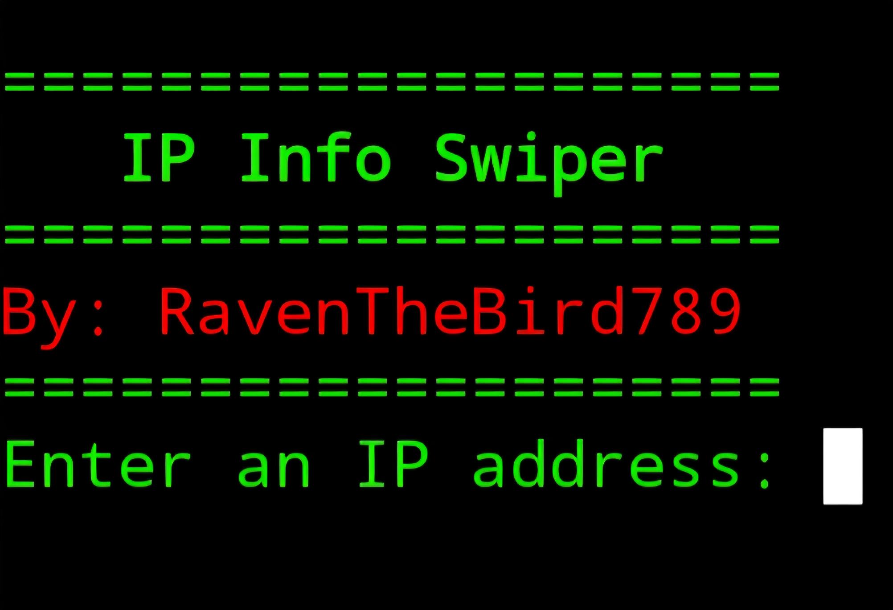

# IP-Info-Swiper ℹ️🔍
Python script that uses the ipwho.is and google maps API's to pull information about a given IP address and return it to the user

Prerequisites:

* Ensure the latest version of python in installed in your terminal (python 3.x)
* Ensure the "requests" python module is installed in your env and/or in your linux environment to ensure the tool works as intended (This can generally be done via the command "pip install requests" or in the case of this project, "pip install -r requirements.txt" once you're env is activated and you're in the "IP-Info-Swiper" directory)

Installation & Execution:

* To install, simply type "git clone https://github.com/RavenTheBird789/IP-Info-Swiper" in your terminals command line

* To run, simply type "python3 ip_info.py" in your terminals command line or use the alias command to create a shortcut to run the program in your terminal such as "alias ip="python3 ip_info.py""

Additional Information:

* The geolocation of the given IP address returned to the user (displayed via latitude and longitude) may not be 100% accurate
